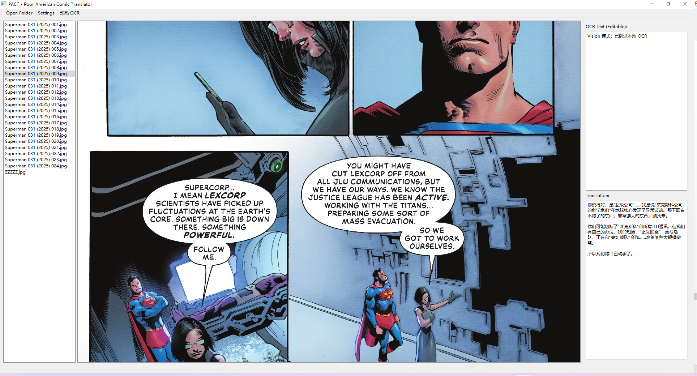
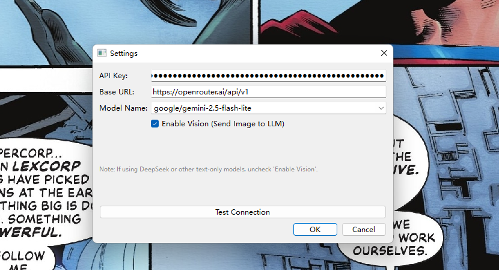
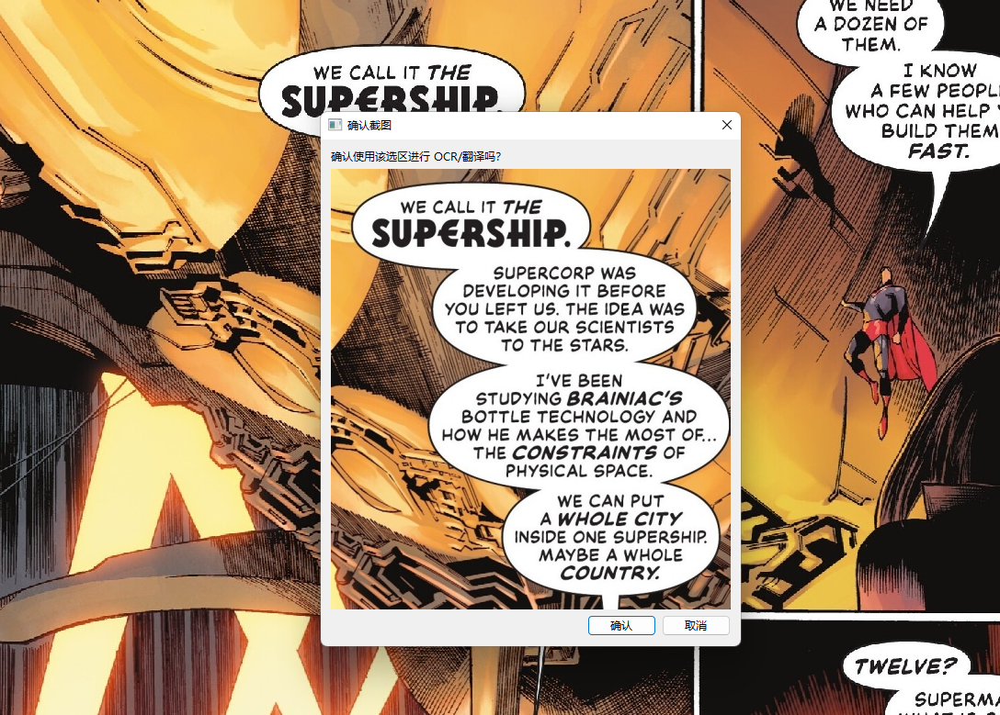
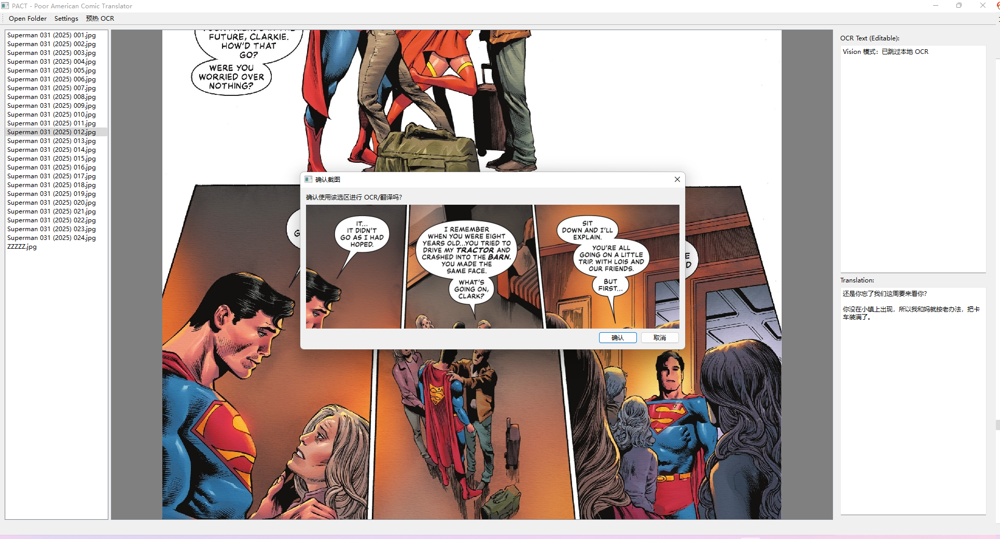
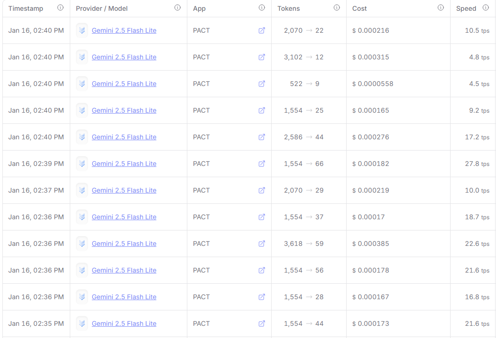

# BubbleTrans（Scrappy Comic Translator）

BubbleTrans 是一个桌面端漫画气泡翻译器：框选对话气泡即可翻译（支持本地 OCR 或 Vision LLM 直翻）。

BubbleTrans is a desktop comic speech-bubble translator: drag-select a bubble to translate (local OCR or Vision LLM).

## 关键词（Keywords）

comic translator, speech bubble translator, manga translator, OCR, Vision, LLM, PyQt6, PaddleOCR, OpenRouter, Gemini

## 适用场景（Use Cases）

- 美漫/漫画对话气泡翻译（高频框选工作流）
- 艺术字/复杂背景导致 OCR 不稳定的场景（推荐 Vision 直翻）
- 想离线识别、仅翻译阶段联网（本地 OCR 模式）

- Translating comic speech bubbles with a fast drag-to-select workflow
- When OCR struggles on stylized fonts / complex backgrounds (Vision-first)
- Offline OCR with online translation only (local OCR mode)

## 安装（Installation）

0. 第一次使用需要创建本地配置：
   - 将 `config.example.json` 重命名为 `config.json`
   - 打开 `config.json`，填写你的 `api_key` / `base_url` / `model`

1. 安装 Python 3.10+。
2. 安装依赖：
   ```
   pip install -r requirements.txt
   ```
   *注：如果 PaddleOCR 安装失败，可能需要安装 C++ Build Tools；多数情况下会有可用的 wheel。*

1. Install Python 3.10+.
2. Install dependencies:
   ```
   pip install -r requirements.txt
   ```
   *Note: If PaddleOCR installation fails, you may need C++ Build Tools; wheels are usually available.*

0. First-time setup (local config):
   - Rename `config.example.json` to `config.json`
   - Fill in `api_key` / `base_url` / `model` in `config.json`

## 使用（Usage）

1. 运行 `run.bat`。
2. 点击 **Settings** 配置你的 API Key（OpenRouter / DeepSeek / OpenAI）。
3. 点击 **Open Folder** 打开包含漫画图片的文件夹。
4. 在左侧列表选择一张图片。
5. **左键按住拖动** 框选一个对话气泡。
   - 默认：先本地 OCR 识别，再调用 LLM 翻译。
   - 勾选 “Enable Vision”：跳过本地 OCR，直接把截图区域交给支持 Vision 的 LLM 读图并翻译（更快、更省心）。
6. **右键按住拖动** 平移画面。
7. **滚轮** 缩放。

1. Run `run.bat`.
2. Click **Settings** to configure your API Key (OpenRouter / DeepSeek / OpenAI).
3. Click **Open Folder** to load a folder containing comic images.
4. Select an image from the left list.
5. **Left click + drag** to select a speech bubble.
   - Default: local OCR first, then LLM translation.
   - With “Enable Vision”: skip local OCR and send the crop to a Vision-capable LLM to read and translate (faster, less waiting).
6. **Right click + drag** to pan the image.
7. **Mouse wheel** to zoom.

## 推荐用法：直接用 Vision 模型（Recommended: Vision-First）

- 推荐直接启用 “Enable Vision”，让支持图片识别的 LLM 直接读图翻译，通常比本地 OCR 预热/识别更快，也能绕开艺术字、复杂背景导致的 OCR 误识别。
- 日常性价比优先：**Gemini 2.5 Flash Lite**（足够好、响应快、便宜）
- 追求更好的翻译效果：**Gemini 3 Flash Preview**（质量更强，但通常更贵、速度也会慢一点）
- 你也可以按自己偏好选择其它支持 Vision 的模型（Claude/GPT/Grok 等）

- We recommend turning on “Enable Vision” so a Vision-capable LLM reads the crop and translates directly. This is often faster than waiting for local OCR and can handle stylized fonts / complex backgrounds better.
- Best value for daily use: **Gemini 2.5 Flash Lite** (fast, cheap, and good enough)
- Best quality: **Gemini 3 Flash Preview** (better quality, usually higher cost and slightly slower)
- You can also pick any other Vision-capable model you like (Claude / GPT / Grok, etc.)

## GitHub SEO（建议）

- 仓库描述（About）建议包含：comic translator / speech bubble / OCR / Vision LLM / PyQt6 / PaddleOCR / OpenRouter / Gemini
- Topics 建议：`comic-translation`, `manga`, `ocr`, `paddleocr`, `pyqt6`, `llm`, `vision`, `openrouter`, `gemini`

## 功能（Features）

- **本地 OCR（Local OCR）**：使用 PaddleOCR 提取文本（离线/本地可用）。
- **DC/Marvel 专有名词保护（Name Safety）**：提示词调优，减少对专有名词的直译风险。
- **Vision 支持（Vision Support）**：可选。可发送截图区域到支持 Vision 的 LLM（如 GPT-4o、Gemini、Claude）。

## 截图（Screenshots）

### 运行界面（Main UI）


### 配置（Settings）


### 截图确认（Crop Confirmation）


### 多气泡翻译（Multi-bubble Translation）


### 多气泡翻译结果（Multi-bubble Result）


### 消费记录（Usage / Cost）


## 安全（Security）

- `config.json` 通常包含 API Key（敏感信息），不要提交到 GitHub；推荐只提交 `config.example.json`。
- 如果曾经把真实密钥提交到 Git 历史里：需要在平台撤销/更换密钥，并清理 Git 历史后再开源。

- `config.json` typically contains your API Key (sensitive). Do not commit it to GitHub; commit `config.example.json` instead.
- If a real key was committed in Git history, revoke/rotate it and rewrite history before going public.

## License

MIT. See [LICENSE](LICENSE).
