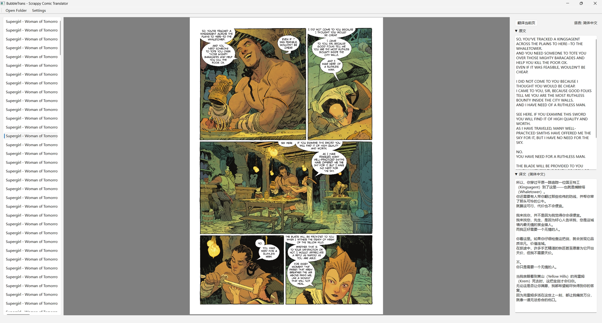
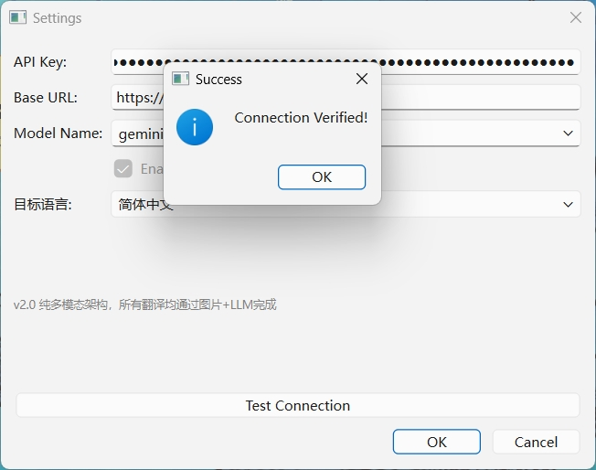

# BubbleTrans v2.0

漫画气泡翻译器 —— 纯多模态大模型驱动，一个按钮翻译整页漫画。

A comic speech-bubble translator powered entirely by multimodal LLMs. One click, one page.

---

## 截图 / Screenshot

| 翻译主界面 / Main UI |
|:---:|
|  |

| Settings 连接测试 / Connection Test |
|:---:|
|  |

---

## 特性 / Features

- **全页翻译**：打开图片 → 点击「翻译当前页」→ 右侧同时显示原文段落和译文段落
- **框选翻译**：鼠标拖框选择任意区域单独翻译（保留 v1.0 操作习惯）
- **纯多模态架构**：放弃本地 OCR，直接发图给 LLM 同时完成识别+翻译，任意语言通吃
- **目标语言切换**：Settings 中支持简体中文、日本語、한국어、English、Français 等
- **绿色免安装**：双击 `run.bat` 自动创建虚拟环境、安装依赖、启动程序，不污染系统
- **中转站友好**：兼容任何 OpenAI 兼容的 API 代理（one-api / new-api / OpenRouter 等）

- **Full-page translation**: Open → click "翻译当前页" → original + translation side by side in paragraphs
- **Area selection**: Drag-select any region for targeted translation (v1.0 workflow preserved)
- **Pure multimodal**: No local OCR — images sent directly to LLM for simultaneous recognition + translation
- **Target language**: Switch between Simplified Chinese, Japanese, Korean, English, French, etc. in Settings
- **Portable**: Double-click `run.bat` — auto-creates venv, installs deps, launches. Zero system pollution.
- **Proxy-friendly**: Works with any OpenAI-compatible API gateway (one-api / new-api / OpenRouter / etc.)

---

## 快速开始 / Quick Start

1. **安装 Python 3.10+** / Install Python 3.10+
2. **双击 `run.bat`** — 自动创建虚拟环境并安装依赖 / Double-click `run.bat` — auto-creates venv and installs deps
3. 点击 **Settings** → 填入中转站 `API Key` / `Base URL` / `Model` → Test Connection
4. 点击 **Open Folder** 打开漫画图片文件夹
5. 选中图片 → 点击「**翻译当前页**」→ 右侧查看结果
6. 或**左键拖框**选择任意气泡区域翻译
7. **右键拖拽**平移，**滚轮**缩放

---

## 依赖 / Dependencies

```
PyQt6>=6.4.0
openai>=1.0.0
Pillow>=9.0.0
```

仅 3 个包。v1.0 时代的 PaddleOCR / paddlepaddle 已完全移除。

Only 3 packages. PaddleOCR / paddlepaddle from v1.0 are completely removed.

---

## 配置 / Configuration

首次运行会自动生成虚拟环境。配置保存在项目根目录 `config.json`（不会被 Git 跟踪）。

| 字段 | 说明 |
|------|------|
| `api_key` | API 密钥 |
| `base_url` | 中转站地址（如 `https://your-proxy.com`，自动补 `/v1`） |
| `model` | 模型名（如 `gemini-2.5-flash`） |
| `target_lang` | 目标翻译语言（默认 `简体中文`） |

---

## 安全 / Security

- `config.json` 包含 API Key，已在 `.gitignore` 中排除
- 如需开源，只提交 `config.example.json`
- `config.json` contains your API Key — excluded from Git via `.gitignore`
- Only commit `config.example.json` when open-sourcing

---

## 关键词 / Keywords

comic translator · speech bubble · manga · multimodal · LLM · Vision · PyQt6 · OpenAI · Gemini · Claude · OpenRouter

---

## License

MIT. See [LICENSE](LICENSE).
