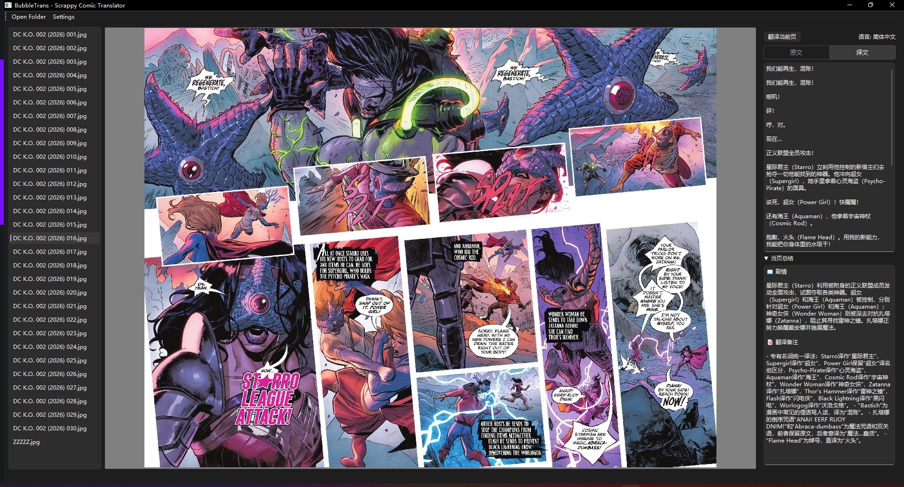

# BubbleTrans v2.1

> 打开漫画 → 点一下 → 翻译 + 剧情总结全有了。
>
> Open a comic page → one click → translation + plot summary, done.

漫画气泡翻译器，纯多模态大模型驱动。不仅翻译文字，还能**看懂剧情**，给你当页的剧情摘要和翻译决策说明。

A comic speech-bubble translator powered by multimodal LLMs. It doesn't just translate — it **understands the story** and gives you a page-level plot summary and translation notes.

---

## 截图 / Screenshot



*翻译主界面：左文件列表 · 中画布 · 右分段切换译文+当页AI总结*
*Main UI: file list (left) · canvas (center) · segmented translation + AI summary (right)*

---

## 为什么选 BubbleTrans / Why BubbleTrans

| 卖点 | 说明 |
|------|------|
| 🧠 **AI 当页总结** | 翻译同时生成剧情摘要 + 翻译备注（专名译法、双关语、文化梗），一次 API 调用全搞定 |
| 🎯 **译文优先设计** | 原文/译文分段切换，默认显示译文——不再被原文挤占空间 |
| ⚡ **纯多模态架构** | 无需本地 OCR，图片直发 LLM，任意语言通吃，仅 3 个依赖 |
| 🔄 **配置档案** | 多套 API 配置（不同中转站/模型）一键切换，不用反复填 key |
| 📦 **零安装** | 双击 `run.bat`，自动创建虚拟环境、安装依赖、启动程序 |

| Highlight | Description |
|-----------|-------------|
| 🧠 **AI Page Summary** | Plot recap + translation notes (name choices, puns, cultural references) generated in the same API call |
| 🎯 **Translation-First UI** | Segmented switch between original/translation, defaults to translation — no space wasted |
| ⚡ **Pure Multimodal** | No local OCR. Image → LLM directly. Any language. Only 3 dependencies. |
| 🔄 **API Profiles** | Save multiple API configs (different proxies/models), switch with one click |
| 📦 **Zero Setup** | Double-click `run.bat` — auto venv, auto deps, auto launch |

---

## 功能 / Features

**核心翻译：**
- **全页翻译** — 点一下翻译整页，LLM 同时完成文字识别和翻译
- **框选翻译** — 鼠标拖框选择任意气泡区域单独翻译
- **分段切换** — 原文/译文共用文本区，一键切换，默认显示译文

**AI 增强：**
- **当页剧情总结** — 2-4 句话概括本页发生的剧情
- **翻译备注** — 专有名词译法、双关语处理、文化梗解释，全透明

**体验：**
- 目标语言切换（简体中文、日本語、한국어、English、Français 等）
- 左右方向键翻页 · 右键拖拽平移 · 滚轮缩放
- 配置档案管理（多套 API 一键切换）
- 兼容任何 OpenAI 兼容中转站（one-api / new-api / OpenRouter 等）

---

**Core Translation:**
- **Full-page** — One click, LLM recognizes + translates everything
- **Area selection** — Drag-select any speech bubble
- **Segmented switch** — Original/translation share one text area, defaults to translation

**AI-Powered:**
- **Page plot summary** — 2-4 sentence recap of what's happening on this page
- **Translation notes** — Name choices, pun handling, cultural references, fully transparent

**Quality of Life:**
- Target language: 简体中文, 日本語, 한국어, English, Français, and more
- Arrow keys to flip pages · right-drag to pan · scroll to zoom
- Multi-profile API management — switch proxies/models with one click
- Works with any OpenAI-compatible gateway

---

## 快速开始 / Quick Start

1. 安装 **Python 3.10+** / Install Python 3.10+
2. 双击 `run.bat` / Double-click `run.bat`
3. Settings → 填入 API Key / Base URL / Model → Test Connection
4. Open Folder → 选择漫画文件夹 / select comic folder
5. 选图 → 点「**翻译当前页**」/ pick a page → click "翻译当前页"
6. 或左键拖框选气泡区域翻译 / or drag-select a bubble area
7. 翻译结果 + 剧情总结自动出现在右侧 / translation + summary appear on the right

---

## 依赖 / Dependencies

```
PyQt6>=6.4.0
openai>=1.0.0
Pillow>=9.0.0
```

仅 3 个包。v1.0 的 PaddleOCR / paddlepaddle 已完全移除。

Only 3 packages. No PaddleOCR, no bloat.

---

## 配置 / Configuration

`config.json`（首次运行自动生成 / auto-generated on first run）：

```json
{
  "profiles": {
    "默认": {
      "api_key": "sk-xxx",
      "base_url": "https://your-proxy.com",
      "model": "gemini-2.5-flash"
    },
    "opencode": {
      "api_key": "sk-xxx",
      "base_url": "https://opencode.ai/zen/go/v1",
      "model": "mimo-v2.5"
    }
  },
  "active_profile": "opencode",
  "target_lang": "简体中文"
}
```

- `profiles` — 多套 API 配置，Settings 中一键切换
- `target_lang` — 目标翻译语言
- `config.json` 包含 API Key，已在 `.gitignore` 中排除

---

## 安全 / Security

- `config.json` excluded from Git via `.gitignore`
- Only commit `config.example.json` when open-sourcing

---

## 关键词 / Keywords

comic translator · speech bubble · manga · multimodal · LLM · Vision · AI summary · PyQt6 · OpenAI · Gemini · OpenRouter

---

## License

MIT. See [LICENSE](LICENSE).
